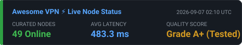

<div align="right">
  <strong>🌐 Language / 语言:</strong>
  <a href="README.md"><b>English</b></a> |
  <a href="README_CN.md"><b>简体中文</b></a>
</div>

# Awesome VPN 🌍

**免费代理节点，每日自动更新。无需配置，复制即用。**

🌐 **一键复制：** https://awesome-vpn.github.io/

<div align="center">

[](https://awesome-vpn.github.io/)
[](README.md)
[](README_CN.md)
[](clash://install-config?url=https://raw.githubusercontent.com/awesome-vpn/awesome-vpn/master/clash.yaml)

</div>

---

## 🚀 30秒快速上手

### 第一步：复制订阅链接

右键点击链接 → "复制链接地址"：

#### 🌟 深度优选高速主订阅（Sing-box实测测速，Top 80 优质节点）

| 格式 | 订阅链接 | 适用客户端 | 一键导入 |
|------|----------|-----------|---------|
| **Clash YAML** | [`https://raw.githubusercontent.com/awesome-vpn/awesome-vpn/master/clash.yaml`](https://raw.githubusercontent.com/awesome-vpn/awesome-vpn/master/clash.yaml) | Clash Verge Rev | [⚡ 一键导入](clash://install-config?url=https://raw.githubusercontent.com/awesome-vpn/awesome-vpn/master/clash.yaml) |
| **Sing-box JSON** | [`https://raw.githubusercontent.com/awesome-vpn/awesome-vpn/master/sing-box.json`](https://raw.githubusercontent.com/awesome-vpn/awesome-vpn/master/sing-box.json) | Sing-box、NekoBox | — |
| **Base64 列表** | [`https://raw.githubusercontent.com/awesome-vpn/awesome-vpn/master/all`](https://raw.githubusercontent.com/awesome-vpn/awesome-vpn/master/all) | v2rayN、v2rayNG | — |

#### ⚡ 现代抗封锁专属协议与生节点池

| 分流通道 | 格式 | 订阅链接 | 特点 |
|---------|------|----------|------|
| **Hysteria 2** | Clash YAML | [`https://raw.githubusercontent.com/awesome-vpn/awesome-vpn/master/hysteria2.yaml`](https://raw.githubusercontent.com/awesome-vpn/awesome-vpn/master/hysteria2.yaml) | 极低延迟，基于 UDP QUIC 抗拥塞阻断 |
| **VLESS Reality** | Sing-box JSON | [`https://raw.githubusercontent.com/awesome-vpn/awesome-vpn/master/reality.json`](https://raw.githubusercontent.com/awesome-vpn/awesome-vpn/master/reality.json) | 无证书伪装，无 SNI 泄漏风险 |
| **全量生节点候选池** | 纯文本 | [`https://raw.githubusercontent.com/awesome-vpn/awesome-vpn/master/raw.txt`](https://raw.githubusercontent.com/awesome-vpn/awesome-vpn/master/raw.txt) | 1,000+ 动态裂变收集但未深度实测的原节点 |

<details>
<summary><b>📋 复制全部精选链接</b></summary>

```
https://raw.githubusercontent.com/awesome-vpn/awesome-vpn/master/clash.yaml
https://raw.githubusercontent.com/awesome-vpn/awesome-vpn/master/sing-box.json
https://raw.githubusercontent.com/awesome-vpn/awesome-vpn/master/all
https://raw.githubusercontent.com/awesome-vpn/awesome-vpn/master/hysteria2.yaml
https://raw.githubusercontent.com/awesome-vpn/awesome-vpn/master/reality.json
```

</details>

> 💡 **不知道选哪个？** 推荐使用 **Clash YAML**（搭配 Clash Verge Rev 一键导入）或 **Sing-box JSON**。


### 第二步：下载客户端软件

> 🛡️ **准入原则：** 本项目仅推荐 **100% 纯开源、100% 纯免费（零广告/零内购）、GitHub Star 超过 20,000+** 的成熟顶级客户端。拒绝任何收费商业闭源软件。

| 系统 | 推荐开源软件 | GitHub Stars | 官方开源与下载地址 |
|------|-------------|--------------|-------------------|
| **Windows** | Clash Verge Rev / v2rayN | 142k★ / 115k★ | [Clash Verge Rev](https://github.com/clash-verge-rev/clash-verge-rev/releases) / [v2rayN](https://github.com/2dust/v2rayN/releases) |
| **macOS** | Clash Verge Rev / Sing-box | 142k★ / 37k★ | [Clash Verge Rev](https://github.com/clash-verge-rev/clash-verge-rev/releases) / [Sing-box](https://github.com/SagerNet/sing-box/releases) |
| **Linux** | Clash Verge Rev / Sing-box | 142k★ / 37k★ | [Clash Verge Rev](https://github.com/clash-verge-rev/clash-verge-rev/releases) / [Sing-box](https://github.com/SagerNet/sing-box/releases) |
| **Android** | v2rayNG / Sing-box / NekoBox | 62k★ / 37k★ / 22k★ | [v2rayNG](https://github.com/2dust/v2rayNG/releases) / [Sing-box](https://github.com/SagerNet/sing-box/releases) / [NekoBox](https://github.com/MatsuriDayo/NekoBoxForAndroid/releases) |
| **iOS** | Sing-box | 37k★ | [App Store 免费安装 (sing-box MT)](https://apps.apple.com/app/sing-box-mt/id6670355458) / [GitHub](https://github.com/SagerNet/sing-box) |

### 第三步：粘贴使用

1. 打开客户端软件
2. 找到「订阅」或「导入」按钮
3. 粘贴第一步复制的链接
4. 点击「更新」或「下载」
5. 选择一个服务器，点击「连接」

---

## 📥 订阅链接（镜像加速）

如果 GitHub 访问慢，试试这些镜像：

| 镜像 | 链接 | 位置 |
|------|------|------|
| **KKGitHub** | `https://raw.kkgithub.com/awesome-vpn/awesome-vpn/master/all` | 香港 |
| **GHProxy** | `https://ghproxy.net/https://raw.githubusercontent.com/awesome-vpn/awesome-vpn/master/all` | 日本 |

---

## ❓ 常见问题

### Q：这是免费的吗？
**是的。** 所有节点都是从公开渠道收集的，无需付费。

### Q：为什么连不上？
可能原因：
- **节点过期**：等待下次自动更新（每天 UTC 00:00）
- **网络被墙**：试试上面的镜像链接
- **格式不对**：确认你用的格式（通用/Sing-box/Clash）和软件匹配

### Q：安全吗？
- 这些是**公共节点**，来自互联网公开渠道
- **不要用于敏感操作**（网银、私人账号等）
- 我们不记录你的流量，但公共节点可能会

### Q：多久更新一次？
**每天 UTC 00:00 自动更新**（北京时间早上8点）

### Q：我应该用哪种格式？
| 如果你的软件是... | 用这个格式 |
|------------------|-----------|
| Clash Verge Rev | **Clash YAML** |
| Sing-box、NekoBox | **Sing-box JSON** |
| v2rayN、v2rayNG | **Base64 列表** |

---

## 🛠️ 故障排除

**"获取订阅失败"**
→ 试试上面的镜像链接，或者先在客户端里开启「系统代理」再试。

**"连接成功但上不了网"**
→ 节点可能失效了。点击「更新订阅」获取最新节点，或换个服务器试试。

**"速度很慢"**
→ 公共节点用的人比较多。多试几个服务器，找到速度快的。

---

## 📱 客户端使用教程

<details>
<summary><b>Clash Verge Rev（Windows / macOS / Linux）</b></summary>

1. 从 [GitHub Releases](https://github.com/clash-verge-rev/clash-verge-rev/releases) 下载对应系统的安装包安装
2. 点击本 README 最上方的 **[⚡ 一键导入]** 按钮，或在软件「订阅/配置」中粘贴 **Clash YAML** 链接
3. 点击右侧「保存并导入」完成下载
4. 在「代理」列表中勾选测速较低的优质节点
5. 打开「系统代理」或「TUN 模式」开关即可上网
</details>

<details>
<summary><b>Sing-box（iOS / Android / macOS）</b></summary>

1. **iOS**：直接在 App Store 免费搜索安装 `sing-box MT`（SagerNet 官方开源）；**Android / PC**：从 [GitHub Releases](https://github.com/SagerNet/sing-box/releases) 下载
2. 打开应用，进入 **Profiles（配置）** 标签页
3. 点击右上角 **+** → 选择 **New Profile**
4. Type 选择 **Remote**，在 URL 栏粘贴 **Sing-box JSON** 订阅链接
5. 点击右上角保存，然后点击配置进行更新
6. 返回 Dashboard 界面，点击 **Start** 开关连接
</details>

<details>
<summary><b>v2rayN（Windows）</b></summary>

1. 从 [GitHub](https://github.com/2dust/v2rayN/releases) 下载并解压
2. 运行 `v2rayN.exe`
3. 点击 **订阅** → **订阅设置**
4. 粘贴Base64 列表链接，点击 **添加** → **确定**
5. 点击 **订阅** → **更新订阅**
6. 右键选择一个服务器 → **设为活动服务器**
7. 点击 **系统代理** → **自动配置系统代理**
</details>

<details>
<summary><b>v2rayNG（安卓）</b></summary>

1. 从 [GitHub](https://github.com/2dust/v2rayNG/releases) 下载安装
2. 点击右上角 **+** → **从剪贴板导入**（或「从URL导入」）
3. 粘贴Base64 列表链接，点击 **导入**
4. 点击右上角菜单（⋮）→ **更新订阅**
5. 点击选择一个服务器
6. 点击底部 **V** 按钮连接
</details>

---

## 🔄 更新时间表

| 更新类型 | UTC时间 | 北京时间 |
|---------|---------|---------|
| 自动更新 | 每天 00:00 | 每天 08:00 |
| 手动触发 | 随时 | 随时（通过 GitHub Actions） |

---

## ⚖️ 免责声明

- 本项目聚合**互联网公开的**代理节点
- **仅供学习研究使用**
- 请遵守当地法律法规
- **不保证可用性** - 节点随时可能失效
- 我们不拥有或控制这些节点

---

## 🌟 Star 趋势

如果这个项目帮到了你，请点个 ⭐ 支持一下！

[](https://star-history.com/#awesome-vpn/awesome-vpn&Date)

---

<p align="center">
  <b>人人享有自由互联网 🌐</b>
</p>
